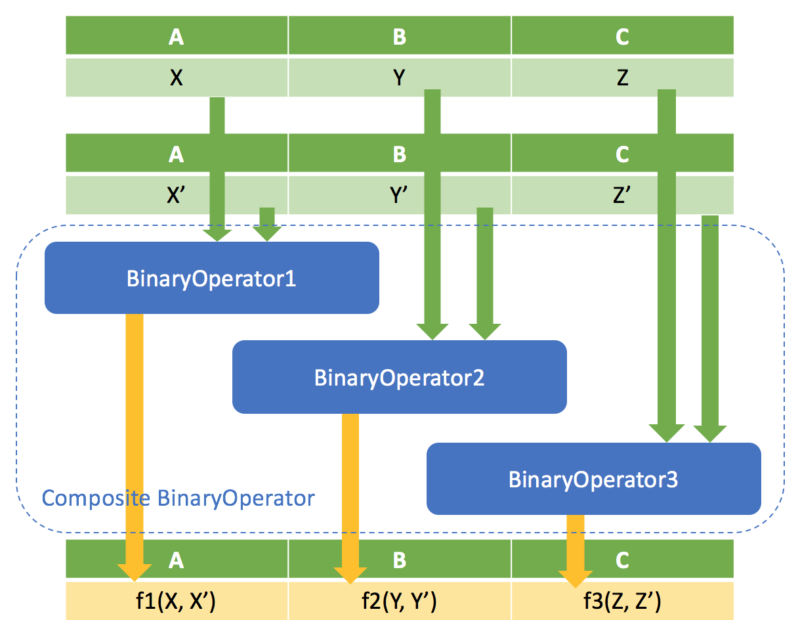
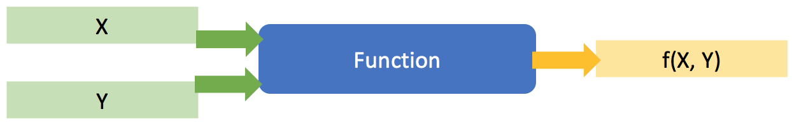
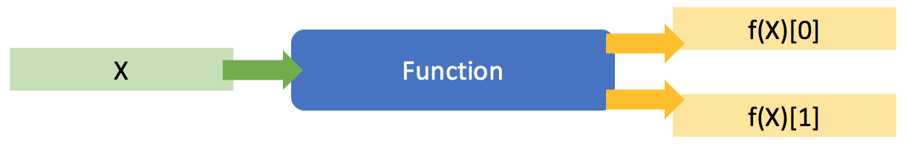
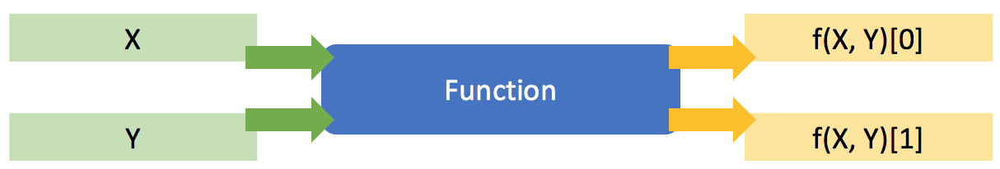
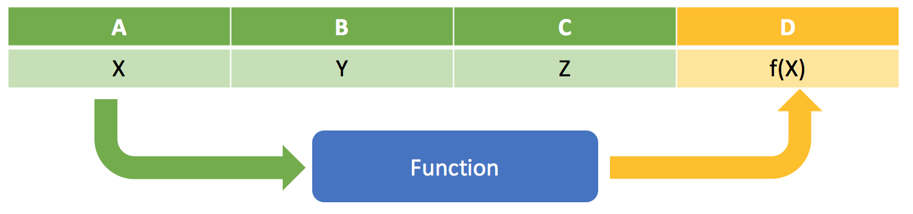
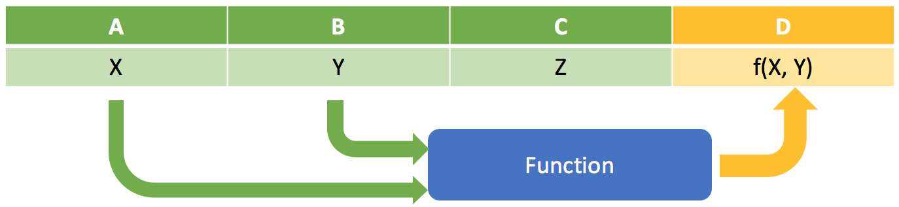
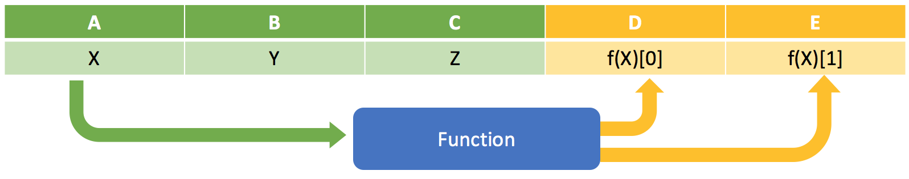
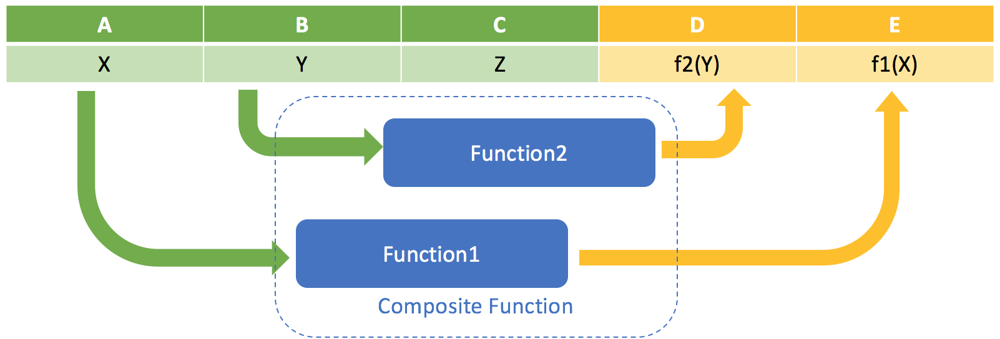

Copyright 2017-2018 Crown Copyright

Licensed under the Apache License, Version 2.0 (the "License");
you may not use this file except in compliance with the License.
You may obtain a copy of the License at

  http://www.apache.org/licenses/LICENSE-2.0

Unless required by applicable law or agreed to in writing, software
distributed under the License is distributed on an "AS IS" BASIS,
WITHOUT WARRANTIES OR CONDITIONS OF ANY KIND, either express or implied.
See the License for the specific language governing permissions and
limitations under the License.

# Koryphe Examples

1. [Binary Operator Examples](#binary-operator-examples)
1. [Function Examples](#function-examples)

## Binary Operator Examples
 
### Adapted Binary Operator applied to a complex object

This example shows how you can apply a simple binary operator (in this case Product) to aggregate a field in a complex object. We will configure the Product function to apply to field 'A' in a Tuple. The result of the product function will be projected back into field 'A'.


[TupleAggregationProductExample.java](src/main/java/uk/gov/gchq/koryphe/example/binaryoperator/TupleAggregationProductExample.java) shows how to create this operator using the Java API. Execute it to produce the following output:

```
Binary Operator json: 
{
  "binaryOperator" : {
    "class" : "uk.gov.gchq.koryphe.impl.binaryoperator.Product"
  },
  "selection" : [ "A" ]
}

Binary Operator inputs: 
{1,2,3}
{4,5,6}
{7,8,9}

Binary Operator output: 
{28,2,3}
```

Field 'A' has been selected from each of the input tuples and passed to the Product operator. The result has been projected back into the first input tuple.

### Composite adapted Binary Operator applied to a complex object

This example shows the composition of a complex Binary Operator by applying simple operators to different fields in a complex object. We will configure the Product, Sum and Min functions to apply to fields A, B and C respectively.



[TupleCompositeAggregationExample.java](src/main/java/uk/gov/gchq/koryphe/example/binaryoperator/TupleCompositeAggregationExample.java) shows how to create this operator using the Java API. Execute it to produce the following output:

```
Binary Operator json: 
{
  "operators" : [ {
    "binaryOperator" : {
      "class" : "uk.gov.gchq.koryphe.impl.binaryoperator.Product"
    },
    "selection" : [ "A" ]
  }, {
    "binaryOperator" : {
      "class" : "uk.gov.gchq.koryphe.impl.binaryoperator.Sum"
    },
    "selection" : [ "B" ]
  }, {
    "binaryOperator" : {
      "class" : "uk.gov.gchq.koryphe.impl.binaryoperator.Min"
    },
    "selection" : [ "C" ]
  } ]
}

Binary Operator inputs: 
{1,2,3}
{4,5,6}
{7,8,9}

Binary Operator output: 
{28,15,3}
```

Field 'A' has been aggregated by the Product operator, field 'B' by the Sum operator and field 'C' by the Min operator.


## Function Examples
 
### Simple Function

In it's simplest form, Koryphe works the same as the Java Function API - it shows a single function being applied to a single input.


[MultiplyByExample.java](src/main/java/uk/gov/gchq/koryphe/example/function/MultiplyByExample.java) shows how to create one of these functions using the Java API. Executing it produces the following output:

```
Function json: 
{
  "class" : "uk.gov.gchq.koryphe.impl.function.MultiplyBy",
  "by" : 2
}

Function inputs: 
1
2
3

Function outputs: 
2
4
6
```

Each input has been multiplied by 2 to produce the stream of output values.

### Simple multi input, single output function

This example shows a Koryphe function that has more than one input value. To do this, we wrap inputs in a tuple.



[MultiplyExample.java](src/main/java/uk/gov/gchq/koryphe/example/function/MultiplyExample.java) shows how to create one of these functions using the Java API. Executing it produces the following output:

```
Function json: 
{
  "class" : "uk.gov.gchq.koryphe.impl.function.Multiply"
}

Function inputs: 
{1,1}
{1,2}
{2,2}

Function outputs: 
1
2
4
```

The function has been used to multiply the 2 input values together, producing a stream of single output values.

### Simple single input, multi output function

In a similar way to the previous example, this example shows how functions can return multiple values by wrapping them in a tuple.



[DivideByExample.java](src/main/java/uk/gov/gchq/koryphe/example/function/DivideByExample.java) shows how to create one of these functions using the Java API. Executing it produces the following output:

```
Function json: 
{
  "class" : "uk.gov.gchq.koryphe.impl.function.DivideBy",
  "by" : 3
}

Function inputs: 
3
6
10

Function outputs: 
{1,0}
{2,0}
{3,1}
```

The function has divided each input by 3, outputting the result of the division and the remainder as a tuple. 

### Simple multi input, multi output function

Bringing the previous 2 examples together, here we show a function with more than one input and output.



[DivideExample.java](src/main/java/uk/gov/gchq/koryphe/example/function/DivideExample.java) shows how to create one of these functions using the Java API. Executing it produces the following output:

```
Function json: 
{
  "class" : "uk.gov.gchq.koryphe.impl.function.Divide"
}

Function inputs: 
{8,1}
{8,2}
{8,3}

Function outputs: 
{8,0}
{4,0}
{2,2}
```

The function has divided the first element of the input tuple by the second to produce the division result and remainder as an output tuple.

### Single input, single output Function applied to a complex object

This example shows how you can apply a simple function to a field in a complex object. We will configure the function to apply to field 'A' in a Tuple. The result of the function will be projected back into field 'D'.



[TupleMultiplyByExample.java](src/main/java/uk/gov/gchq/koryphe/example/function/TupleMultiplyByExample.java) shows how to create this adapted function using the Java API. Execute it to produce the following output:

```
Function json: 
{
  "function" : {
    "class" : "uk.gov.gchq.koryphe.impl.function.MultiplyBy",
    "by" : 2
  },
  "selection" : [ "A" ],
  "projection" : [ "D" ]
}

Function inputs: 
{1,2,3}
{4,5,6}
{7,8,9}

Function outputs: 
{1,2,3,2}
{4,5,6,8}
{7,8,9,14}
```

Field 'A' has been selected from each of the input tuples and passed to the function, which multiplies it by 2. The results have been projected back into a new field 'D'.

### Multiple input, single output Function applied to a complex object

This example shows how you can apply a function to multiple fields in a complex object. We will configure the function to apply to field 'A' and 'B' in a Tuple. The result of the function will be projected back into field 'D'.



[TupleMultiplyExample.java](src/main/java/uk/gov/gchq/koryphe/example/function/TupleMultiplyExample.java) shows how to create this adapted function using the Java API. Execute it to produce the following output:

```
Function json: 
{
  "function" : {
    "class" : "uk.gov.gchq.koryphe.impl.function.Multiply"
  },
  "selection" : [ "A", "B" ],
  "projection" : [ "D" ]
}

Function inputs: 
{1,2,3}
{4,5,6}
{7,8,9}

Function outputs: 
{1,2,3,2}
{4,5,6,20}
{7,8,9,56}
```

Fields 'A' and 'B' have been selected from each of the input tuples and passed to the function, which multiplies them together. The results have been projected back into a new field 'D'.

### Single input, multiple output Function applied to a complex object

This example shows how you can apply a function to a field in a complex object, projecting multiple output objects. We will configure the function to apply to field 'A' in a Tuple. The results of the function will be projected back into fields 'D' and 'E'.



[TupleDivideByExample.java](src/main/java/uk/gov/gchq/koryphe/example/function/TupleDivideByExample.java) shows how to create this adapted function using the Java API. Execute it to produce the following output:

```
Function json: 
{
  "function" : {
    "class" : "uk.gov.gchq.koryphe.impl.function.DivideBy",
    "by" : 4
  },
  "selection" : [ "A" ],
  "projection" : [ "D", "E" ]
}

Function inputs: 
{1,2,3}
{4,5,6}
{7,8,9}

Function outputs: 
{1,2,3,0,1}
{4,5,6,1,0}
{7,8,9,1,3}
```

Field 'A' has been selected from each of the input tuples and passed to the function, which divides it by 4. The division result and remainder have been projected back into a new fields 'D' and 'E'.

### Multiple input, multiple output Function applied to a complex object

This example shows how you can apply a function to multiple fields in a complex object, projecting multiple output objects. We will configure the function to apply to fields 'A' and 'B' in a Tuple. The results of the function will be projected back into fields 'D' and 'E'.


[TupleDivideExample.java](src/main/java/uk/gov/gchq/koryphe/example/function/TupleDivideExample.java) shows how to create this adapted function using the Java API. Execute it to produce the following output:

```
Function json: 
{
  "function" : {
    "class" : "uk.gov.gchq.koryphe.impl.function.Divide"
  },
  "selection" : [ "A", "B" ],
  "projection" : [ "D", "E" ]
}

Function inputs: 
{3,2,1}
{10,4,6}
{15,2,9}

Function outputs: 
{3,2,1,1,1}
{10,4,6,2,2}
{15,2,9,7,1}
```

Fields 'A' and 'B' have been selected from each of the input tuples and passed to the function, which divides 'A' by 'B'. The division result and remainder have been projected back into a new fields 'D' and 'E'.

### Composite Function applied to a complex object

This example shows how you can combine functions into a composite and apply it to fields in a complex object, projecting multiple output objects. We will configure a composite function to apply one function to field 'A' and project it's result into field 'E', and apply another function to field 'B' and project it's result into field 'D'.



[TupleCompositeMultiplyByExample.java](src/main/java/uk/gov/gchq/koryphe/example/function/TupleCompositeMultiplyByExample.java) shows how to create this composite function using the Java API. Execute it to produce the following output:

```
Function json: 
{
  "functions" : [ {
    "function" : {
      "class" : "uk.gov.gchq.koryphe.impl.function.MultiplyBy",
      "by" : 2
    },
    "selection" : [ "A" ],
    "projection" : [ "E" ]
  }, {
    "function" : {
      "class" : "uk.gov.gchq.koryphe.impl.function.MultiplyBy",
      "by" : 3
    },
    "selection" : [ "B" ],
    "projection" : [ "D" ]
  } ]
}

Function inputs: 
{1,2,3}
{4,5,6}
{7,8,9}

Function outputs: 
{1,2,3,6,2}
{4,5,6,15,8}
{7,8,9,24,14}
```

Field 'A' has been selected and passed to a function that multiplies it by 2 and the result has been projected into field 'E'. Field 'B' has been selected and passed to a function that multiplies it by 3 and the result has been projected back into field 'D'.
